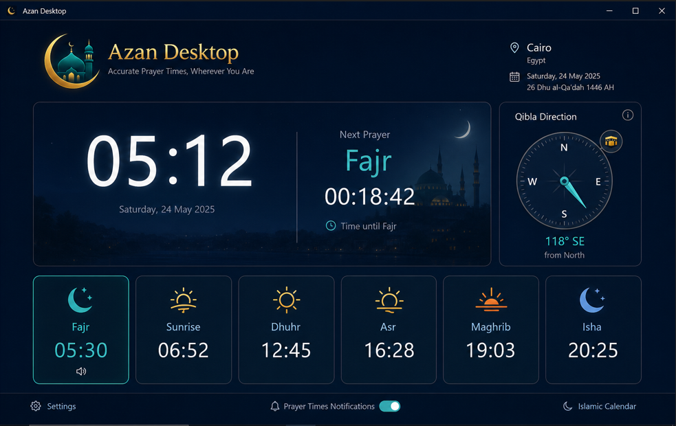
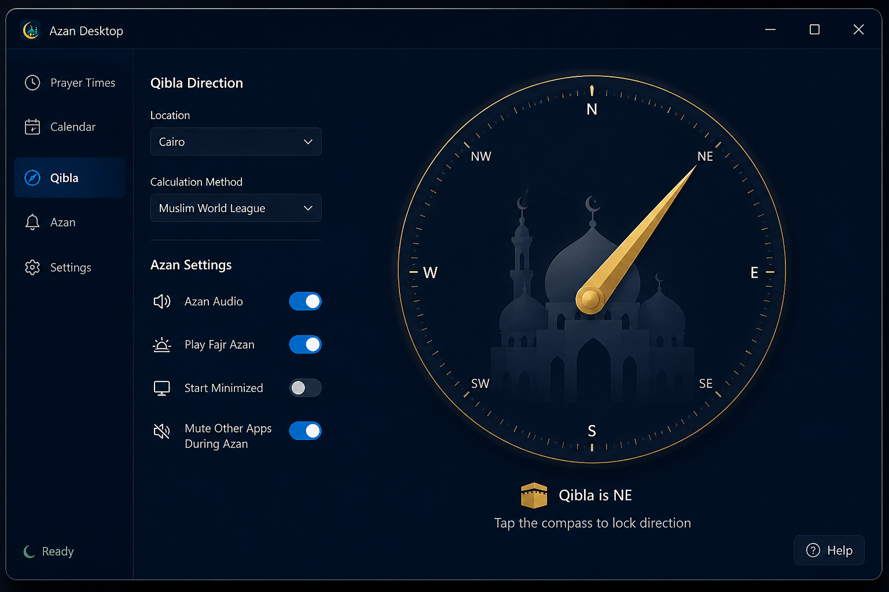

  

<h1 align="center">🕌 Azan Desktop</h1>

  <strong>Islamic prayer times and Azan notifications for Windows</strong> 
  Live clock, Azan audio, Qibla compass, tray countdown, offline fallback.

  
  
  

  
  
  

---

> **📌 Repository notice**  
> Public product page + official installer only. **Source code is not open source.**  
> Developer hub: **[Ryuk-Dev](https://github.com/heema2/Ryuk-Dev)**

---

## ✨ What is Azan Desktop?

Azan Desktop is a native **Windows 10 / 11** app for prayer times and Azan. Pick your city, hear Azan at prayer time, and keep a countdown in the system tray.

| | Feature |
|---|---|
| 🕌 | Prayer times (coordinates + timezone + calculation method) |
| 📴 | Offline fallback using cached times |
| 🕒 | Live clock in the selected city's timezone |
| 🔔 | Azan audio (Fajr / general Azan / optional dua) |
| 🧭 | Qibla compass and location panel |
| 📌 | Close hides to tray · optional start minimized |
| 🔇 | Optional mute/deafen other apps during Azan (Discord bypass) |

---

## 🖼️ Look & feel

  
  &nbsp;
  

---

## 🚀 Quick start

👉 **[AzanDesktop-Setup-1.0.8.exe](https://github.com/heema2/Azan-Desktop/releases/latest/download/AzanDesktop-Setup-1.0.8.exe)**  
All versions: **[Releases](https://github.com/heema2/Azan-Desktop/releases)**

1. Run the setup (per-user install — **no admin UAC**).
2. Launch **Azan Desktop**.
3. Choose your city / calculation method in Settings.
4. Keep it in the tray for countdown tooltips.

No separate .NET runtime is required (self-contained).

---

## 💾 Requirements

- Windows **10** or **11** (64-bit)

---

## 💬 Contact & copyright

Built by **Heema Star (Ryuk)** under **Ryuk Developments**.

| | |
|---|---|
| 🏠 Main hub | [github.com/heema2/Ryuk-Dev](https://github.com/heema2/Ryuk-Dev) |
| 🐙 GitHub | [github.com/heema2](https://github.com/heema2) |
| 💬 Discord | [discord.com/users/198843596558958601](https://discord.com/users/198843596558958601) |

© 2026 Ryuk Developments. All rights reserved.

